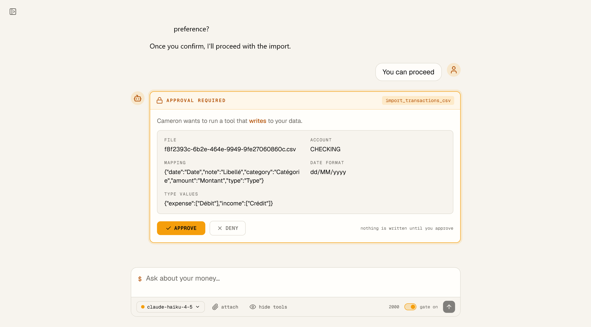
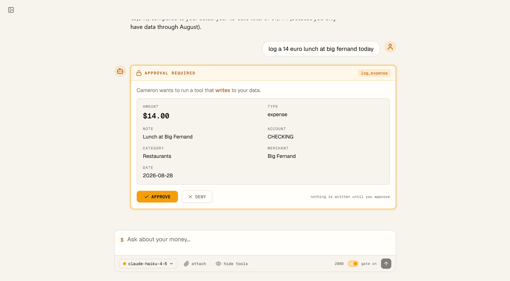
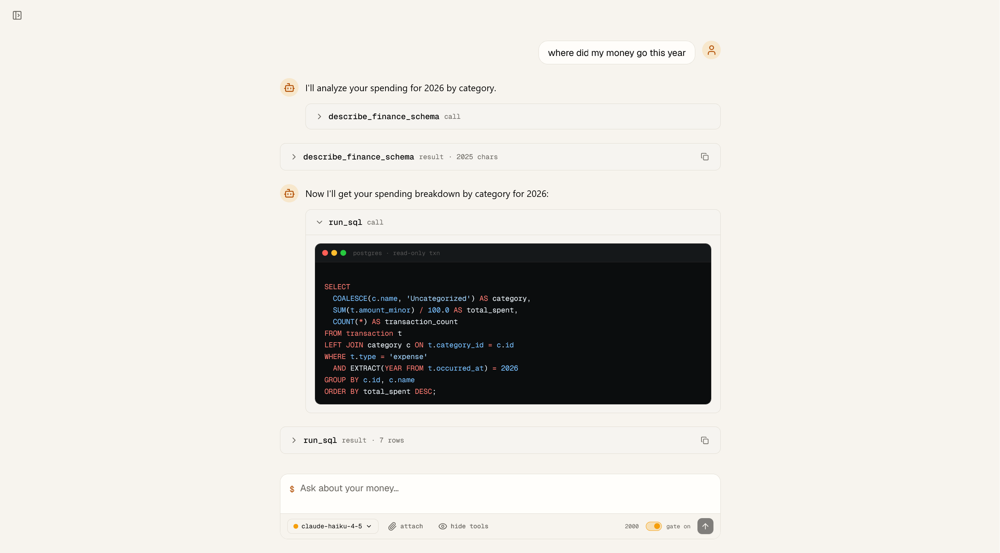
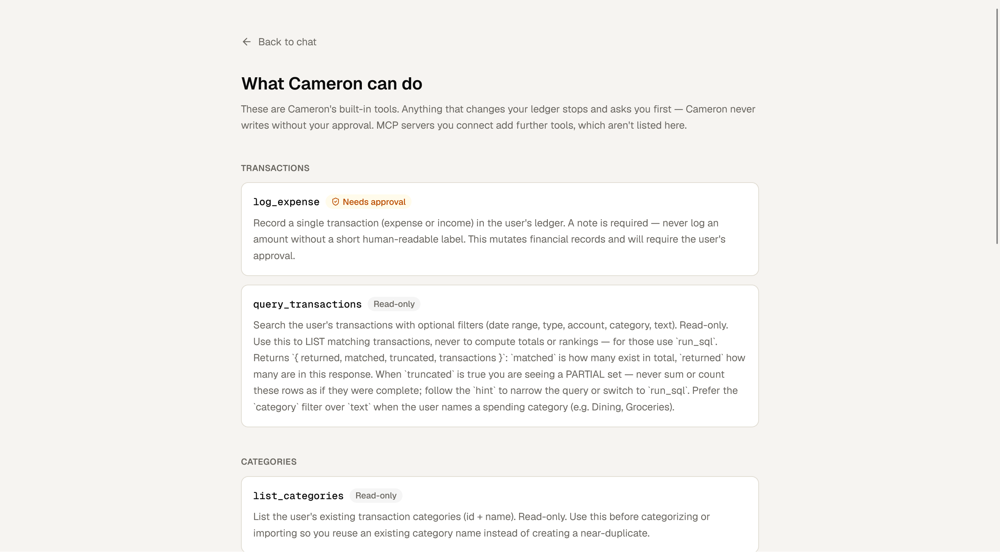
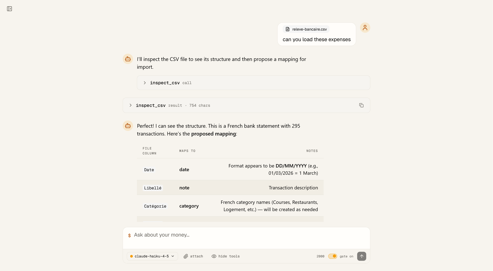

# Cameron

> **A personal finance agent you own and run yourself.** Built in public alongside the
> [Agentailor](https://blog.agentailor.com) blog — one tagged release per article.

<!-- SCREENSHOT: the thread with an approval gate open — the amber "APPROVAL REQUIRED" card.
     This is the money shot; it shows the one rule that defines Cameron. -->



_Cameron asks before it writes. Every time, for every capability._

[](https://github.com/agentailor/cameron/releases/latest)
[](https://github.com/agentailor/cameron/actions)
[](https://www.typescriptlang.org/)
[](https://nextjs.org/)
[](https://langchain-ai.github.io/langgraphjs/)
[](https://www.postgresql.org/)

---

## What Cameron is

Cameron tracks spending, imports bank exports, answers questions about where the money went, and
— over the arc of the series — learns to build its own capabilities. It runs on your machine,
against your Postgres, with your API key.

It's built for two audiences at once: the **owner**, who dogfoods it daily on real finances, and
the **reader**, a developer learning agent engineering by running Cameron against seed data.

### Three rules, never relaxed

1. **Cameron never moves money or mutates financial records without explicit human approval.**
2. **Every capability passes the same approval gate** — built-in, skill, connector, or
   self-written. No exceptions, no allowlist.
3. **All financial data stays on infrastructure the owner controls.**

These aren't aspirations. Rule 1 is enforced by a human-in-the-loop interrupt in the graph; rule 2
by a single `MUTATING_TOOL_NAMES` list that the middleware and the capabilities page both read;
rule 3 by the fact that nothing ships to a hosted backend — the database is yours.

---

## What it looks like

<table>
  <tr>
    <td align="center" width="50%">
      <!-- SCREENSHOT: an approval gate mid-thread, expanded, showing the amount/category grid -->
      
      <br /><strong>The approval gate</strong>
      <br />Nothing is written until you approve it.
    </td>
    <td align="center" width="50%">
      <!-- SCREENSHOT: a run_sql tool call expanded — highlighted SQL + the result table -->
      
      <br /><strong>Ask anything, in SQL</strong>
      <br />Read-only queries, shown as written and as run.
    </td>
  </tr>
  <tr>
    <td align="center" width="50%">
      <!-- SCREENSHOT: /capabilities page -->
      
      <br /><strong>Every capability, listed</strong>
      <br />What Cameron can do, and what needs your approval.
    </td>
    <td align="center" width="50%">
      <!-- SCREENSHOT: CSV import flow — inspect_csv then the gated import -->
      
      <br /><strong>Import your bank export</strong>
      <br />Cameron proposes the mapping; you confirm it.
    </td>
  </tr>
</table>

---

## Quick start

**Prerequisites:** Node 20+, pnpm, Docker (for Postgres and MinIO), and an API key for one of
Anthropic / OpenAI / Google.

```bash
git clone https://github.com/agentailor/cameron
cd cameron
pnpm install

cp .env.example .env       # add your model API key
docker compose up -d       # Postgres :5544, MinIO :9100/:9101
pnpm db:migrate
pnpm dev                   # http://localhost:3100
```

Then ask it something — _"what did I spend on dining last month?"_ — or drop in a CSV export and
let it propose a column mapping.

The tests are free and offline: `pnpm test` runs with no model, no network and no database.

---

## Built in public, one tag per article

Cameron ships as a linear series of tagged releases — `v1`, `v2`, `v3`, … — one (or two) per
article. Reading about a topic? Check out the tag for the article that taught it. The release
badge above always points at the current one; whatever it shows is what `main` is.

The series opens with **[`v1`: Cameron is born](https://github.com/agentailor/cameron/releases/tag/v1)**
— the persona and hard rules, a transaction store you own, approval-gated finance tools, and CSV
import. It's the first release where Cameron stops being a generic chat starter and becomes
itself.

📖 **[Follow the series →](https://blog.agentailor.com/cameron)**

---

## Documentation

The technical detail lives in [`docs/`](docs/) rather than here:

| Doc                                       | What's in it                                                                                                                                            |
| ----------------------------------------- | ------------------------------------------------------------------------------------------------------------------------------------------------------- |
| [ARCHITECTURE.md](docs/ARCHITECTURE.md)   | System overview, agent workflow, data flow, database schema, MCP integration, approval process, streaming, **project structure**, **available scripts** |
| [TESTING.md](docs/TESTING.md)             | Why the unit suite stays free and offline, and what belongs in evals instead                                                                            |
| [API.md](docs/API.md)                     | The generated OpenAPI spec, served at `/api/openapi` and browsable at `/api-docs`                                                                       |
| [OAUTH.md](docs/OAUTH.md)                 | OAuth for MCP servers that need it                                                                                                                      |
| [OBSERVABILITY.md](docs/OBSERVABILITY.md) | Langfuse tracing setup                                                                                                                                  |
| [eval/README.md](eval/README.md)          | The paid, non-deterministic eval suite — never in CI                                                                                                    |

[CLAUDE.md](CLAUDE.md) carries the conventions a coding agent needs to work in this repo.

---

## Built on a starter

The foundation Cameron builds on — the chat loop, streaming, persistence, dynamic MCP tool
loading, human-in-the-loop approvals, and multi-model support — comes from
[`fullstack-langgraph-nextjs-agent`](https://github.com/agentailor/fullstack-langgraph-nextjs-agent),
a generic LangGraph.js + Next.js agent starter.

That inherited base is referred to as **v0** throughout these docs. It is not a Cameron release
and carries no `v0` tag — Cameron's own history starts at `v1`. The starter keeps its job as the
reusable scaffold; full credit and thanks to it.

Cameron is part of **[Agentailor](https://agentailor.com)**, the hub for developers building AI
agents. It's the Path 1 flagship — _build it yourself, own every layer_.

---

## Contributing

Issues and pull requests are welcome. Before opening a PR:

```bash
pnpm test          # must pass, and must stay free/offline
npx tsc --noEmit   # must be clean
pnpm format        # Prettier
```

New tools ship with their test in the same commit — see [TESTING.md](docs/TESTING.md) for why
that rule exists.

---

## Need help taking this to production?

I help teams design and optimize LangGraph-based AI agents (RAG, memory, latency, architecture).
If you're building something serious on top of this and want hands-on help,
[DM me on LinkedIn](https://www.linkedin.com/in/ali-ibrahim-junior/) — happy to jump on a short
call.

---

## License

MIT — see [LICENSE](LICENSE).

### Acknowledgments

- [`fullstack-langgraph-nextjs-agent`](https://github.com/agentailor/fullstack-langgraph-nextjs-agent) — the starter Cameron's v0 foundation is seeded from
- [LangChain](https://github.com/langchain-ai) for LangGraph.js
- [Model Context Protocol](https://modelcontextprotocol.io/) for the tool integration standard
- [Next.js](https://nextjs.org/) for the framework

---

**Follow Cameron as it grows, one release at a time.** →
[the series](https://blog.agentailor.com/cameron)
