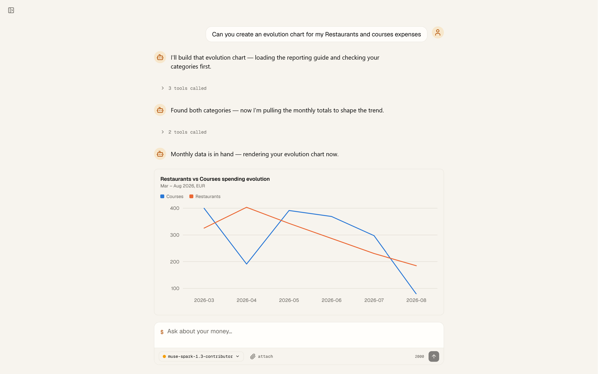

# Cameron

> **A personal finance agent you own and run yourself.** Built in public alongside the
> [Agentailor](https://blog.agentailor.com) blog — one tagged release per article.


_Cameron asks before it writes. Every time, for every capability._

[](https://github.com/agentailor/cameron/releases/latest)
[](https://github.com/agentailor/cameron/actions)
[](https://www.typescriptlang.org/)
[](https://nextjs.org/)
[](https://langchain-ai.github.io/langgraphjs/)
[](https://www.postgresql.org/)

---

## What Cameron is

Cameron tracks spending, imports bank exports, answers questions about where the money went, and
— over the arc of the series — learns to build its own capabilities. It runs on your machine,
against your Postgres, with your API key.

It's built for two audiences at once: the **owner**, who dogfoods it daily on real finances, and
the **reader**, a developer learning agent engineering by running Cameron against seed data.

### Three rules, never relaxed

1. **Cameron never moves money or mutates financial records without explicit human approval.**
2. **Every capability passes the same approval gate** — built-in, skill, connector, or
   self-written. No exceptions, no allowlist.
3. **All financial data stays on infrastructure the owner controls.**

These aren't aspirations. Rule 1 is enforced by a human-in-the-loop interrupt in the graph; rule 2
by a single `MUTATING_TOOL_NAMES` list that the middleware and the capabilities page both read;
rule 3 by the fact that nothing ships to a hosted backend — the database is yours.

---

## What it looks like

<table>
  <tr>
    <td align="center" width="50%">
      
      <br /><strong>The approval gate</strong>
      <br />Nothing is written until you approve it.
    </td>
    <td align="center" width="50%">
      
      <br /><strong>Ask anything, in SQL</strong>
      <br />Read-only queries, shown as written and as run.
    </td>
  </tr>
  <tr>
    <td align="center" width="50%">
      
      <br /><strong>Every capability, listed</strong>
      <br />What Cameron can do, and what needs your approval.
    </td>
    <td align="center" width="50%">
      
      <br /><strong>Import your bank export</strong>
      <br />Cameron proposes the mapping; you confirm it.
    </td>
  </tr>
</table>

---

## Skills: instructions loaded on demand

Cameron's know-how doesn't all live in the system prompt. A **skill** is a folder in
[`skills/`](skills/) holding a `SKILL.md` — instructions in the
[AgentSkills](https://agentskills.io/specification) format. Only each skill's name and description
sit in the prompt; the agent calls `load_skill` to pull the full body into context when it decides
the skill is relevant. That's progressive disclosure: the instructions cost you nothing until
they're being used.



_Asked for an evolution chart, Cameron loads `expense-reporter`, queries the monthly totals, and
draws the chart the skill told it to pick._

Adding one is a file, not a code change — create `skills/<name>/SKILL.md` with `name` and
`description` frontmatter and restart. An invalid skill is dropped and logged; the valid ones still
load, and an empty `skills/` directory is not an error.

**Reading a skill approves nothing it tells you to do.** `load_skill` is read-only, so it
auto-approves — but the instructions it returns reach mutating tools through the same gate as
everything else. Rule 2 holds: the approval boundary does not move because the agent read
something first.

See [docs/SKILLS.md](docs/SKILLS.md) for the validation rules, the failure policy, and why
`skills/` (shipped product code) is not `.agents/skills/` (gitignored dev tooling).

---

## Quick start

### Run it (Docker only)

**Prerequisites:** Docker, and a model to talk to — an API key for Anthropic, OpenAI or Google, or
any **OpenAI-compatible** endpoint (Ollama, vLLM, LM Studio, Groq, OpenRouter, DeepSeek). A local
runtime needs no key at all; you point Cameron at its base URL in Settings.

You pick the provider and model **in the app**, not in the environment — with nothing chosen
Cameron says it's unconfigured rather than guessing. `.env` only ever holds the keys.

```bash
git clone --branch v2 https://github.com/agentailor/cameron
cd cameron

cp .env.example .env              # add your model API key, if your provider needs one
docker compose --profile full up  # http://localhost:3100
```

That builds the app, waits for Postgres, applies migrations, and starts everything. Nothing but
Docker is needed on your machine.

> **Why `--branch v2`?** Tags are the stable points — each one matches a published article and has
> passed CI before release. `main` is the working trunk and runs ahead of the latest tag between
> articles, so it may carry half-finished work. Clone the [latest
> release](https://github.com/agentailor/cameron/releases/latest) to start from something known
> good; `git checkout main` if you want what's in flight.

This is the stack that holds your real financial records — its Postgres (`:5546`) and MinIO
(`:9102`) are separate containers on separate volumes from the dev stack below, so working on
Cameron can't disturb your data. Stop it with `docker compose --profile full down`; adding `-v`
to that command **deletes your financial data**.

### Work on it (app on the host)

**Prerequisites:** the above, plus Node 20+ and pnpm.

```bash
pnpm install
cp .env.example .env       # add your model API key, if your provider needs one
docker compose up -d       # dev dependencies — Postgres :5544, MinIO :9100/:9101
pnpm db:migrate
pnpm dev                   # http://localhost:3100
```

This stack is disposable: it serves `mydb_dev` on its own volumes, and `docker compose down -v`
resets it without touching anything above.

Then ask it something — _"what did I spend on dining last month?"_ — or drop in a CSV export and
let it propose a column mapping.

The tests are free and offline: `pnpm test` runs with no model, no network and no database.

---

## Built in public, one tag per article

Cameron ships as a linear series of tagged releases — `v1`, `v2`, `v3`, … — one (or two) per
article. Reading about a topic? Check out the tag for the article that taught it:
`git checkout v1`. The release badge above points at the newest tag, and
[`release.yml`](.github/workflows/release.yml) gates every `v*` tag on the test suite and a
typecheck, so a tag is a point that built and passed.

`main` is where the next version is assembled, so it sits **ahead** of the newest tag and can carry
work that isn't finished yet. That's what a trunk is for — but it means the tag, not `main`, is the
place to start if you want Cameron to behave the way an article describes.

The series opens with **[`v1`: Cameron is born](https://github.com/agentailor/cameron/releases/tag/v1)**
— the persona and hard rules, a transaction store you own, approval-gated finance tools, and CSV
import. It's the first release where Cameron stops being a generic chat starter and becomes
itself.

📖 **[Follow the series →](https://blog.agentailor.com/cameron)**

---

## Documentation

The technical detail lives in [`docs/`](docs/) rather than here:

| Doc                                       | What's in it                                                                                                                                            |
| ----------------------------------------- | ------------------------------------------------------------------------------------------------------------------------------------------------------- |
| [ARCHITECTURE.md](docs/ARCHITECTURE.md)   | System overview, agent workflow, data flow, database schema, MCP integration, approval process, streaming, **project structure**, **available scripts** |
| [SKILLS.md](docs/SKILLS.md)               | How skills load, the validation rules, and how they're packaged for production                                                                          |
| [TESTING.md](docs/TESTING.md)             | Why the unit suite stays free and offline, and what belongs in evals instead                                                                            |
| [API.md](docs/API.md)                     | The generated OpenAPI spec, served at `/api/openapi` and browsable at `/api-docs`                                                                       |
| [OAUTH.md](docs/OAUTH.md)                 | OAuth for MCP servers that need it                                                                                                                      |
| [OBSERVABILITY.md](docs/OBSERVABILITY.md) | Langfuse tracing setup                                                                                                                                  |
| [eval/README.md](eval/README.md)          | The paid, non-deterministic eval suite — never in CI                                                                                                    |

[CLAUDE.md](CLAUDE.md) carries the conventions a coding agent needs to work in this repo.

---

## Built on a starter

The foundation Cameron builds on — the chat loop, streaming, persistence, dynamic MCP tool
loading, human-in-the-loop approvals, and multi-model support — comes from
[`fullstack-langgraph-nextjs-agent`](https://github.com/agentailor/fullstack-langgraph-nextjs-agent),
a generic LangGraph.js + Next.js agent starter.

That inherited base is referred to as **v0** throughout these docs. It is not a Cameron release
and carries no `v0` tag — Cameron's own history starts at `v1`. The starter keeps its job as the
reusable scaffold; full credit and thanks to it.

Cameron is part of **[Agentailor](https://agentailor.com)**, the hub for developers building AI
agents. It's the Path 1 flagship — _build it yourself, own every layer_.

---

## Contributing

Issues and pull requests are welcome. Before opening a PR:

```bash
pnpm test          # must pass, and must stay free/offline
npx tsc --noEmit   # must be clean
pnpm format        # Prettier
```

New tools ship with their test in the same commit — see [TESTING.md](docs/TESTING.md) for why
that rule exists.

---

## Need help taking this to production?

I help teams design and optimize LangGraph-based AI agents (RAG, memory, latency, architecture).
If you're building something serious on top of this and want hands-on help,
[DM me on LinkedIn](https://www.linkedin.com/in/ali-ibrahim-junior/) — happy to jump on a short
call.

---

## License

MIT — see [LICENSE](LICENSE).

### Acknowledgments

- [`fullstack-langgraph-nextjs-agent`](https://github.com/agentailor/fullstack-langgraph-nextjs-agent) — the starter Cameron's v0 foundation is seeded from
- [LangChain](https://github.com/langchain-ai) for LangGraph.js
- [Model Context Protocol](https://modelcontextprotocol.io/) for the tool integration standard
- [Next.js](https://nextjs.org/) for the framework

---

**Follow Cameron as it grows, one release at a time.** →
[the series](https://blog.agentailor.com/cameron)
